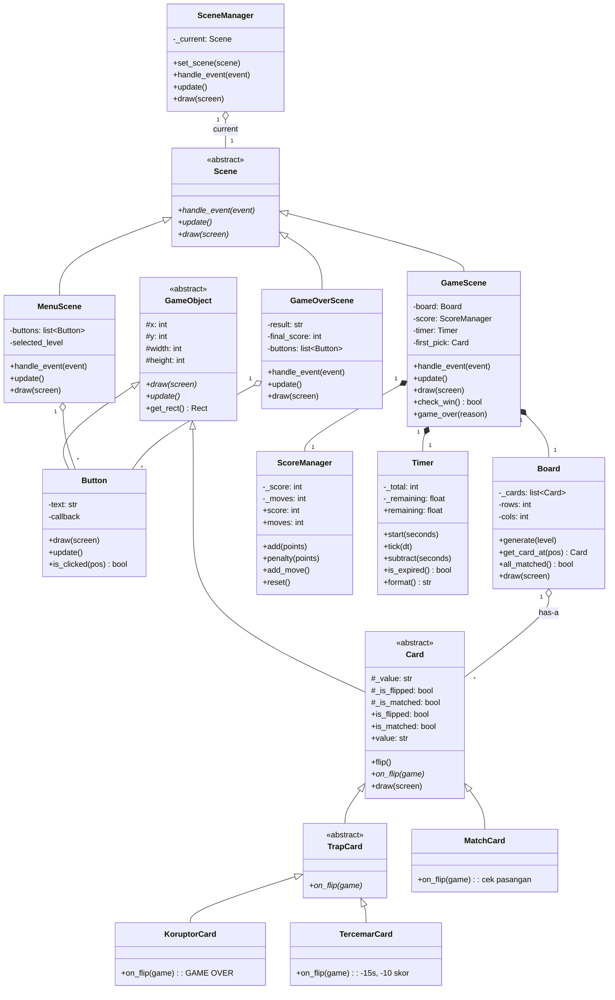
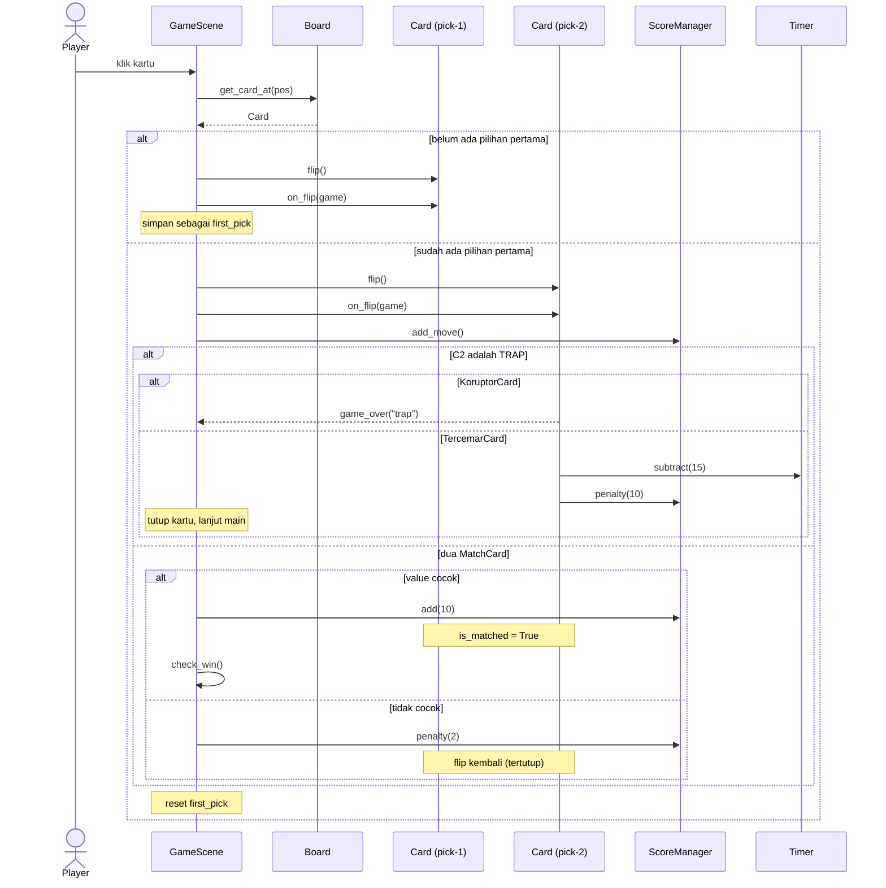
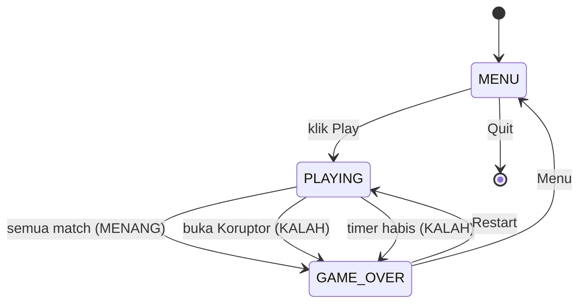
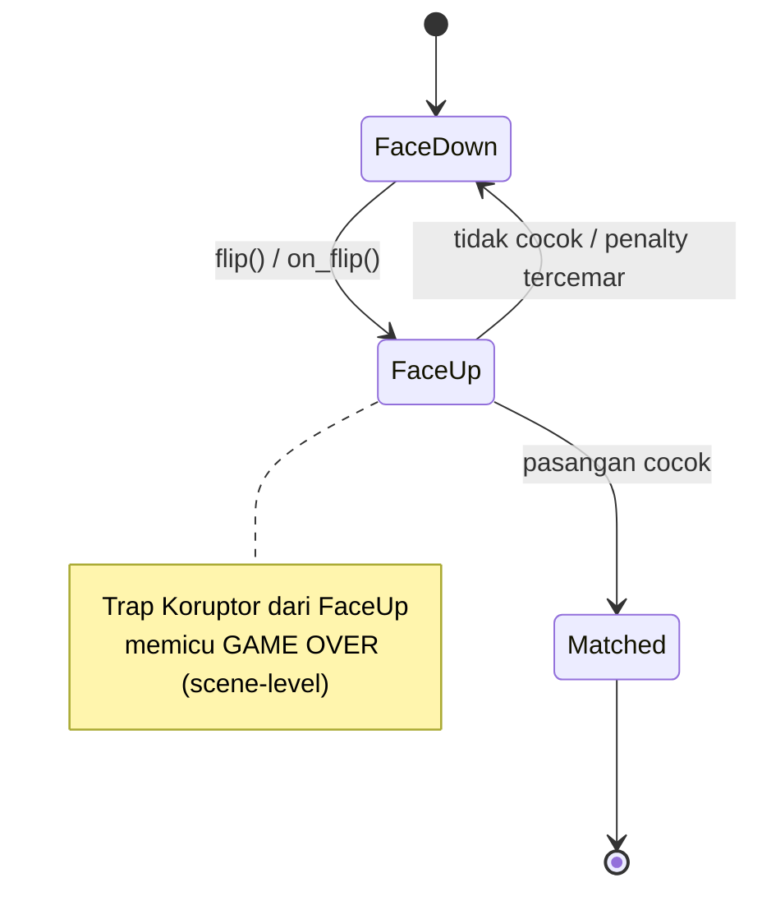

# UML — MBG Memory Match

Diagram arsitektur untuk implementasi OOP. Lihat juga [`PRD.md`](./PRD.md) dan [`requirment-system.md`](./requirment-system.md).

Diagram ditulis dengan **Mermaid** (render otomatis di GitHub/VS Code Markdown Preview Mermaid).

---

## 1. Class Diagram



### Pemetaan Pilar OOP

| Pilar | Bukti di diagram |
|---|---|
| **Abstraction** | `GameObject`, `Card`, `Scene`, `TrapCard` = `<<abstract>>` dengan abstractmethod (`draw`, `update`, `on_flip`, ...) |
| **Inheritance** | `Card → MatchCard/TrapCard`, `TrapCard → Koruptor/Tercemar`, `Scene → Menu/Game/GameOver` |
| **Polymorphism** | `on_flip(game)` beda perilaku: `MatchCard` (cek pasangan) vs `KoruptorCard` (game over) vs `TercemarCard` (penalty) |
| **Encapsulation** | `_is_flipped`, `_is_matched`, `_score`, `_moves`, `_remaining` private + akses lewat property |
| **Composition** | `Board *-- Card`, `GameScene *-- Board/ScoreManager/Timer` (has-a) |

---

## 2. Sequence Diagrams

### 2a. Flip Logic (membuka 2 kartu)



### 2b. Scene Transition (menu → main → game over)

```mermaid
sequenceDiagram
    actor Player
    participant Main as main loop
    participant SM as SceneManager
    participant Menu as MenuScene
    participant Game as GameScene
    participant Over as GameOverScene

    Player->>Menu: pilih level + klik Play
    Menu->>SM: set_scene(GameScene(level))
    SM->>Game: aktif

    loop tiap frame
        Main->>SM: handle_event / update / draw
        SM->>Game: delegasi
    end

    alt menang / trap koruptor / timeout
        Game->>SM: set_scene(GameOverScene(result))
        SM->>Over: aktif
    end

    alt klik Restart
        Over->>SM: set_scene(GameScene(level))
    else klik Menu
        Over->>SM: set_scene(MenuScene())
    end
```

---

## 3. State Diagram

### 3a. Game (scene-level)



### 3b. Card (state satu kartu)



---

## 4. Catatan Implementasi

- `on_flip(game)` menerima referensi `GameScene` agar kartu bisa memengaruhi `ScoreManager`/`Timer`/state (cara polymorphism memberi efek berbeda).
- `Board.generate(level)` membaca konfigurasi difficulty (§4 PRD): jumlah baris/kolom, jumlah pasangan, dan selalu menyisipkan 1 `KoruptorCard` + 1 `TercemarCard`, lalu mengacak posisi.
- `Timer.tick(dt)` dipanggil tiap frame dengan delta-time agar countdown independen dari FPS.
- Klik diabaikan bila kartu sudah `matched`, sudah `flipped`, atau saat 2 kartu sedang dievaluasi.

---

*Diagram ini cetak biru arsitektur; nama atribut/method bisa disesuaikan saat implementasi selama relasi & pilar OOP tetap terjaga.*
